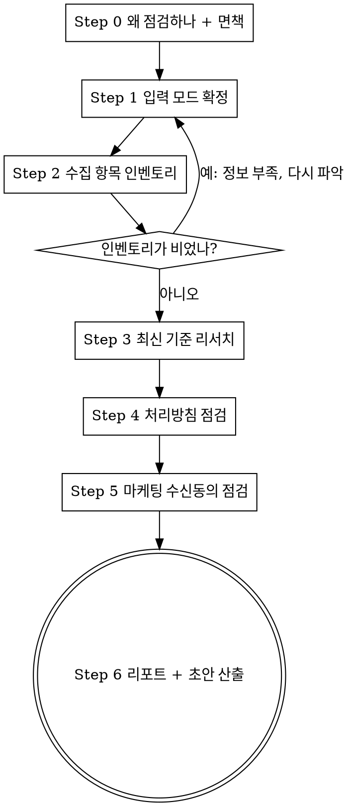

# privacy-check — 내 서비스, 개인정보 제대로 다루고 있나

AI에게 "로그인 만들어줘", "통계 붙여줘"라고 했더니 알아서 붙여줬다. 그래서 **내 서비스가 지금 뭘 받아서 어디에 저장하는지 목록으로 본 적이 없다.** 이 스킬은 그 목록을 먼저 만들고, 그다음에 개인정보 처리방침과 마케팅 수신동의를 점검한다.

## 지켜야 할 선 (넘지 않는다)

- **법률 자문이 아니다.** 점검 결과는 "여기를 확인해보라"는 안내다. 최종 판단과 책임은 사용자에게 있다. 건강정보·결제·만 14세 미만 대상 서비스는 기준이 더 엄격하므로 **반드시 별도 확인이 필요하다고 명시**한다.
- **추측 금지.** 코드나 화면에서 실제로 확인한 것만 "확인됨"으로 적는다. 못 본 것은 "확인 필요"로 분리한다. 이 둘을 섞지 않는다.
- **지어내지 않는다.** 처리방침 초안에 실제로 수집하지 않는 항목을 적으면 그게 더 큰 문제가 된다. 모르는 칸은 `[ 확인 필요: ~~~ ]`로 남기고 무엇을 채워야 하는지 알려준다.
- **사용자 코드를 고치지 않는다.** 산출물은 리포트와 문서 초안까지다. 코드 수정은 사용자가 별도로 요청할 때만 한다.
- **기준을 하드코딩하지 않는다.** 법령과 가이드라인은 바뀐다. 실행할 때마다 Step 2에서 최신 기준을 확인하고, 리포트에 확인 시점과 출처를 남긴다.

## 진행 순서

**Step 2를 건너뛰고 Step 4로 가지 않는다.** 뭘 수집하는지 모르면 방침이 맞는지도 판단할 수 없다. 방침 점검은 "문서에 적힌 것"과 "실제로 하는 것"을 대조하는 작업이고, 인벤토리가 그 대조의 한쪽 축이다.

---

## Step 0 — 왜 점검하는지 먼저 말한다

점검을 시작하기 전에 사용자에게 3~4줄로 설명한다. **겁주는 게 목적이 아니다.** 상세 설명과 표현은 `reference/why-it-matters.md`를 읽고 그 톤을 따른다.

반드시 전달할 것:
- 적용 대상은 "개인정보를 처리하는 자"라서 매출·직원 수 기준이 없다. 1인 개발자도 비영리도 포함된다.
- 이메일 주소 하나만 받아도 개인정보다. 로그인이 없어도 문의 폼이 있으면 해당된다.
- **방침을 써놓고 안 지키는 게 방침이 아예 없는 것보다 무겁게 다뤄진다.** 그래서 문서-실제 대조가 이 점검의 핵심이다.
- 법률 자문이 아니다.

## Step 1 — 어떻게 파악할지 정한다

`AskUserQuestion`으로 입력 모드를 묻는다. **복수 선택을 허용한다.**

| 모드 | 입력 | 확인 가능한 것 |
|---|---|---|
| **A. 코드** | 저장소 경로 | 수집 지점, DB 스키마, 외부 SDK·API, 동의 UI, 탈퇴·삭제 로직 |
| **B. URL** | 배포된 주소 | 방침 페이지 접근성, 가입 폼, 동의 체크박스 구조, 쿠키 배너, 푸터 링크 |
| **C. 설명** | 말로 설명 | 질문으로 파악 (아직 안 만들었거나 코드·URL 접근이 안 될 때) |

**A+B를 함께 쓰는 것이 가장 정확하다.** 코드만 보면 "화면에서 동의를 어떻게 받는지" 모르고, URL만 보면 "탈퇴 시 실제로 지우는지" 모른다. 사용자가 하나만 골랐고 다른 쪽도 있어 보이면 한 번 권한다 — 단, 강요하지 않고 없으면 그대로 진행한다.

## Step 2 — 수집 항목 인벤토리부터 만든다

`reference/data-inventory.md`를 읽고 선택된 모드에 맞는 조사 절차를 따른다.

산출은 항상 **표 하나**다. 각 행에 어떤 정보를 / 어디에 저장하고 / 동의를 받는지 / 외부로 나가는지 / 지울 수 있는지가 들어간다. 그리고 표 아래에 **"사용자가 예상 못 할 만한 수집 항목"**을 따로 짚는다 — 자동 수집되는 IP·접속기록, AI API로 나가는 입력값, 분석 도구가 심는 식별자 같은 것들이다.

인벤토리를 사용자에게 보여주고 **"빠진 게 있는지" 확인받은 뒤** 다음 단계로 간다.

## Step 3 — 지금 기준으로 점검한다

`reference/research-sources.md`의 출처와 검색어를 써서 웹으로 현행 기준을 확인한다. 최소한 이것들:

- 개인정보보호위원회 「개인정보 처리방침 작성지침」 최신판 — 특히 **생성형 AI 서비스 부록** (AI 서비스라면 해당됨)
- 개인정보 보호법 및 시행령 최근 개정 사항
- 정보통신망법 제50조 관련 최신 가이드

확인한 날짜와 출처 URL을 기록해 둔다. 리포트에 그대로 들어간다.

## Step 4 — 개인정보 처리방침 점검

`reference/policy-checklist.md`를 읽고 순서대로 점검한다. 큰 틀은 4단계다:

1. **존재하고 접근 가능한가** — 방침이 있는지, 로그인 없이 볼 수 있는지, 링크가 죽지 않았는지
2. **필수 기재사항이 다 있는가** — 개인정보 보호법 제30조 제1항 각 호
3. **문서와 실제가 일치하는가** ← **가장 중요.** Step 2 인벤토리와 방침을 한 줄씩 대조한다
   - 방침에 적혀 있는데 실제로 안 하는 것 (예: "탈퇴 시 즉시 파기"인데 soft delete만 됨)
   - 실제로 하는데 방침에 없는 것 (고지 없이 수집한 것이 됨)
4. **동의를 제대로 받는가** — 수집·이용 동의 시 알려야 할 4가지 (제15조 제2항)

## Step 5 — 마케팅 수신동의 점검

`reference/marketing-consent-checklist.md`를 읽고 점검한다. 서비스가 광고성 정보를 전혀 보내지 않으면 **"해당 없음"으로 명시하고 넘어간다** — 다만 그 판단 근거를 적는다(발송 코드·메일 템플릿·SMS API 사용 흔적이 없음 등). 나중에 뉴스레터 하나만 붙여도 적용 대상이 되므로 그 사실은 알려준다.

## Step 6 — 산출물

`reference/report-format.md`의 양식대로 **현재 작업 디렉토리 아래 `privacy-check-result/` 폴더**에 3개 파일을 쓴다. (스킬 저장소 폴더명과 겹치지 않도록 `-result`를 붙인다.)

| 파일 | 내용 |
|---|---|
| `report-YYYY-MM-DD.md` | 점검 결과. 🔴즉시 / 🟡곧 / 🟢개선 순 정렬 |
| `privacy-policy-draft.md` | 인벤토리 기반 처리방침 초안. 모르는 칸은 `[ 확인 필요 ]` |
| `consent-copy.md` | 수집·이용 동의 화면 문구, 마케팅 수신동의 문구 예시 |

리포트의 모든 지적에는 **세 가지가 다 들어가야 한다**: 무엇이 문제인지 / 왜 문제인지(근거 조항과 쉬운 설명) / 어떻게 고치는지(구체적 문구나 코드). "왜"가 빠지면 사용자는 납득하지 못하고 고치지도 않는다.

파일을 저장한 뒤, 채팅에서는 **🔴 항목만 요약**해서 알려준다. 전문은 파일에 있다.

## 해외 서비스 경고 트리거

인벤토리에서 아래 중 하나라도 잡히면, 리포트 최상단에 별도 배너를 넣는다:

- 국외 서버·서비스에 개인정보가 저장되거나 전송됨 (Supabase, Vercel, AWS 해외 리전, OpenAI·Anthropic API 등)
- 해외 이용자를 받고 있거나 받을 계획 (다국어 지원, 해외 결제 수단)

배너 내용: **개인정보 국외 이전은 별도 고지·동의 사항**이며, EU 이용자가 있으면 GDPR, 캘리포니아 이용자가 있으면 CCPA가 **추가로** 적용될 수 있다. 이 스킬은 한국 법 기준으로만 점검했으므로 해당 부분은 별도 확인이 필요하다고 명시한다. 상세 점검은 이 스킬의 범위 밖이다 — 아는 척하지 않는다.

## 자주 하는 실수

| 실수 | 왜 문제인가 |
|---|---|
| 인벤토리 없이 방침부터 점검 | 대조할 기준이 없으니 "형식만 갖췄네" 수준에서 끝난다 |
| 다른 서비스 방침을 복사해 초안 작성 | 실제로 수집 안 하는 항목이 들어가고, 하는 항목이 빠진다. 둘 다 위반이다 |
| "확인 못 함"을 "문제 없음"으로 처리 | 리포트가 거짓이 된다. 못 본 건 못 봤다고 쓴다 |
| 필수 동의와 마케팅 동의를 한 체크박스로 | 마케팅 동의는 반드시 분리되고 거부 가능해야 한다 |
| 과태료 금액만 강조 | 사용자가 겁만 먹고 뭘 고칠지 모른다. 항상 "어떻게 고치나"까지 |
| 법령 내용을 기억으로 작성 | 개정된다. Step 3에서 확인하고 출처를 남긴다 |
